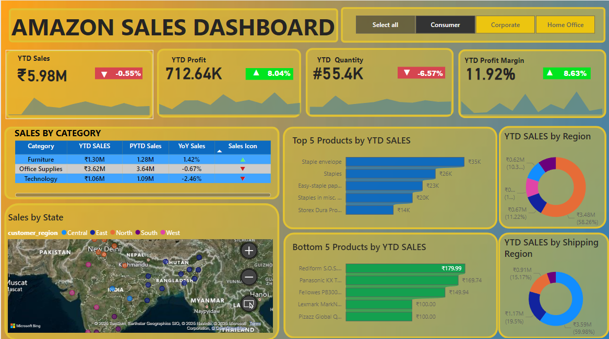

# Amazon Sales Dashboard

This repository showcases an **interactive Power BI dashboard** created using dummy Amazon sales data. The dashboard provides a detailed Year-to-Date (YTD) analysis of sales, profit, quantity, and profit margin across different categories, products, regions, and customer segments.

---

## 🚀 Key Features

### 📊 General Insights
- **YTD Sales**: Total sales achieved so far this year.
- **YTD Profit**: Total profit generated so far.
- **YTD Quantity**: Total number of items sold.
- **YTD Profit Margin**: Percentage of profit earned relative to sales.

### 📂 Breakdown by Categories
- **Furniture**
- **Office Supplies**
- **Technology**

### 🛒 Product Analysis
- **Top 5 Products by YTD Sales**
- **Bottom 5 Products by YTD Sales**

### 📍 Regional Insights
- Sales visualized by state and customer regions (Central, East, North, South, and West).

---

## ⚙️ Customer Segments
The dashboard includes filters to view data for specific customer segments:
- **Consumer**
- **Corporate**
- **Home Office**

### 1. **Consumer Segment**
The **Consumer** segment provides insights into purchases made by individual customers. This segment typically has smaller but frequent transactions.

### 2. **Corporate Segment**
The **Corporate** segment focuses on sales to businesses, often involving bulk orders and higher transaction values.

### 3. **Home Office Segment**
The **Home Office** segment represents sales to small businesses or home-based offices.

---

## 📍 Sales by Region and Shipping
- Regional sales distribution displayed via pie charts and maps.
- Insights into shipping region performance and trends.

---

## 🛠️ How to Use
1. Open the Power BI file to explore the dashboard interactively.
2. Use the filters (Consumer, Corporate, Home Office) to analyze segment-specific data.
3. Navigate through visualizations for detailed insights into categories, products, and regions.

---

## 🌟 Technologies Used
- **Power BI** for dashboard creation.
- **Dummy Data** for Amazon sales metrics.
- **MS SQL SERVER** for Data integration and management.

---

## 🔗 About the Data
This dashboard uses simulated data for demonstration purposes only. The numbers, products, and insights do not reflect actual Amazon sales data.

---

## 📝 Author
- Created by [Devesh Jaluka](https://github.com/dj216185)
